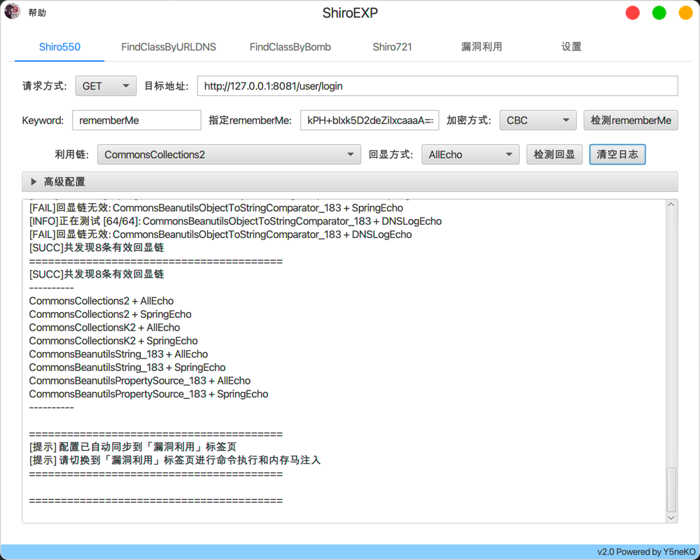
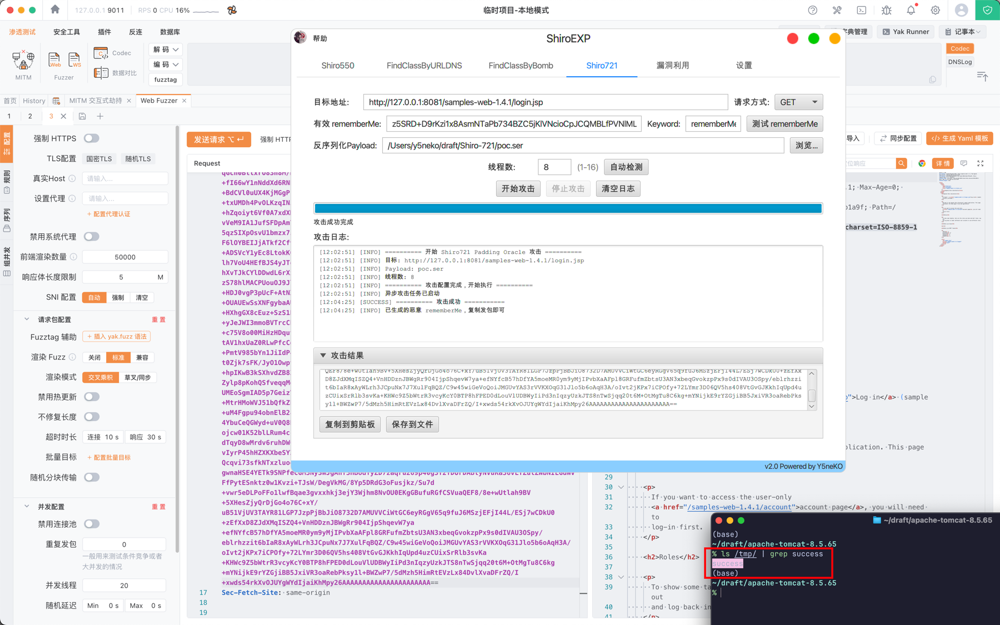
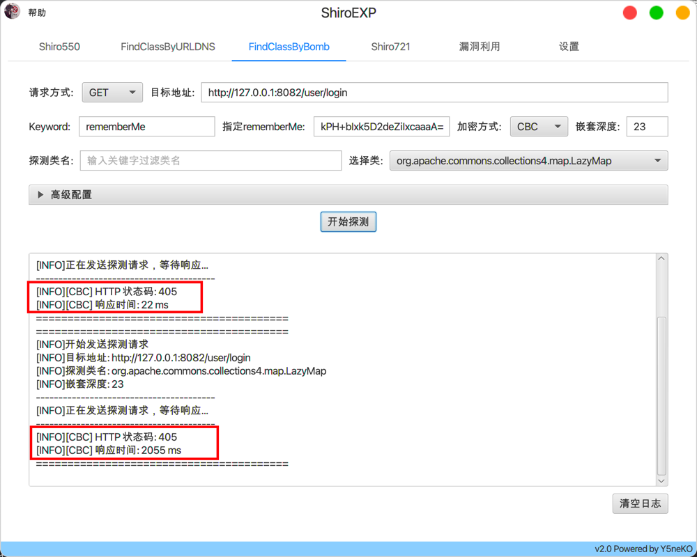
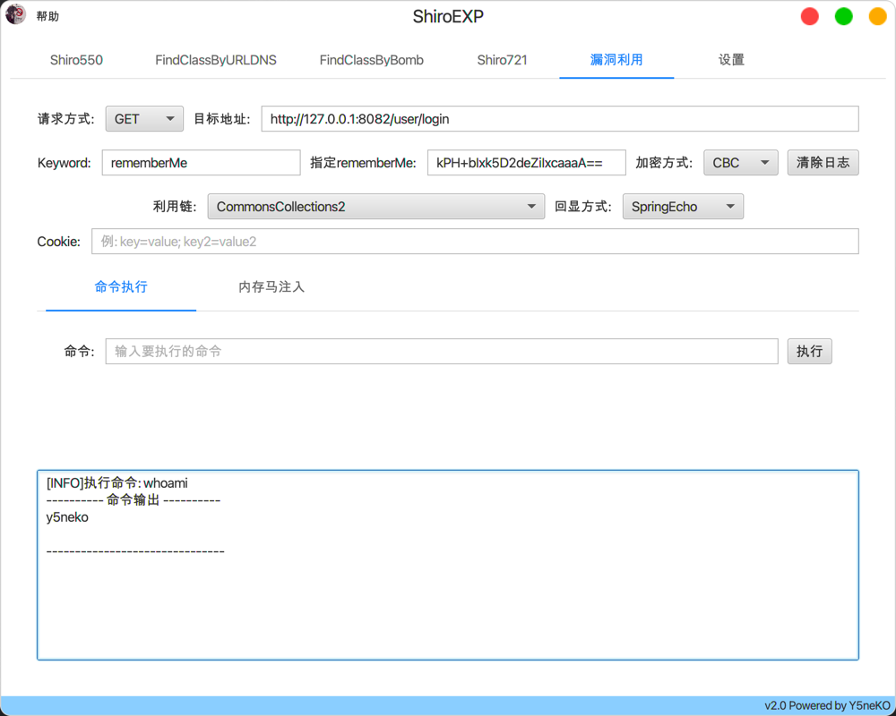
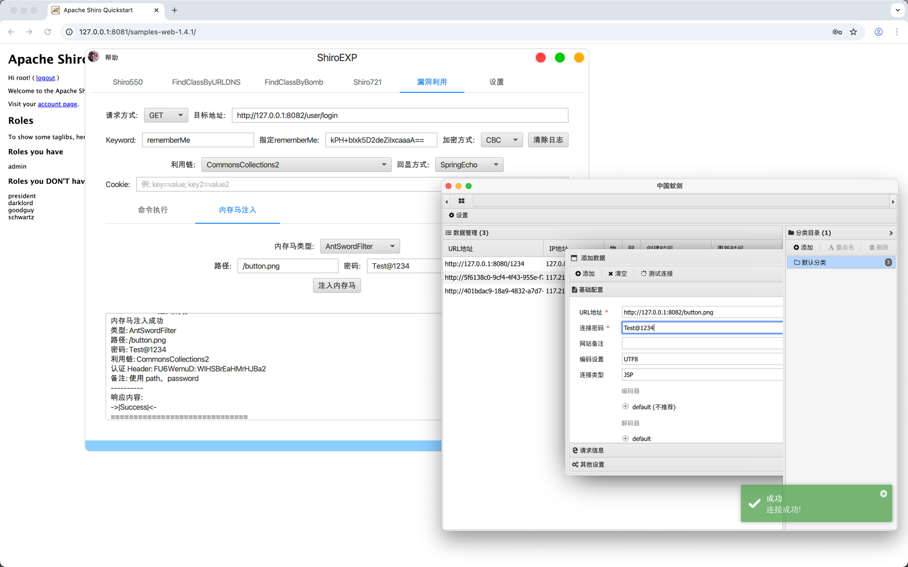
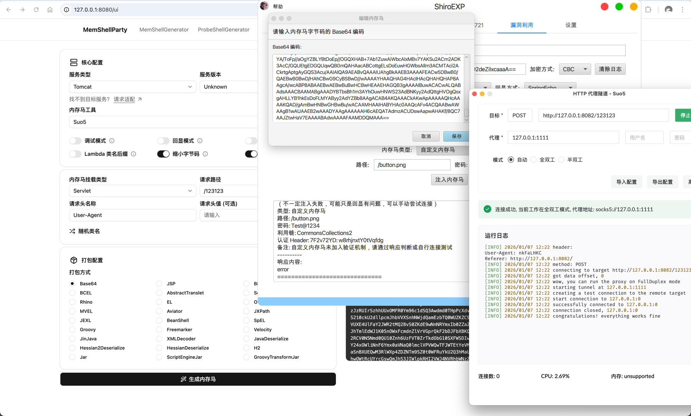

# ShiroEXP

Shiro漏洞综合利用工具

## Environment

`JDK 8u431` | `Intellij 2024`

> ⚠️ _使用其他JDK版本可能出现未知的错误_

## Features

- 爆破rememberMe
- 漏洞探测(Shiro550、Shiro721)
- 探测回显链
- 探测依赖（FindClassByURLDNS、FindClassByBomb）
- 命令执行
- 注入内存马
- 全局代理

## Help

## Demonstrate

### Shiro550

### Shiro721

### FindClassByURLDNS

自定义探测类

### FindClassByBomb

### 命令执行

### 内存马注入

自定义内存马

## Build

自行编译打jar包时，可能会遇到**找不到或无法加载主类**的问题，经排查是因为bcprov包中的签名文件，打包后删除*.DSA、*.SF文件即可

## Thanks

@frohoff   https://github.com/frohoff/ysoserial

@SummerSec  https://github.com/SummerSec/ShiroAttack2

@c0ny1 https://github.com/woodpecker-framework/ysoserial-for-woodpecker

@feihong-cs https://github.com/feihong-cs/ShiroExploit-Deprecated

## Warnning

**本工具仅可用作学习用途和授权渗透测试，使用本工具造成的后果由使用者自行承担。**