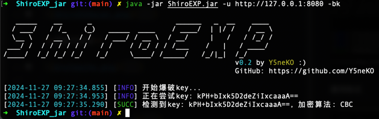
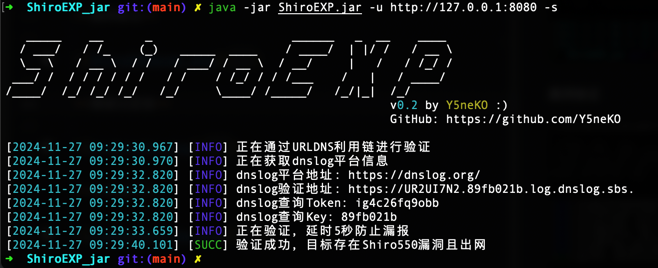
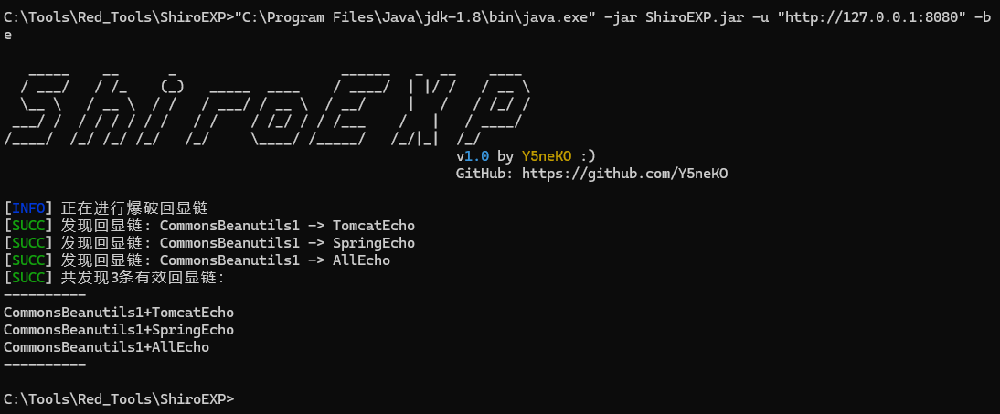
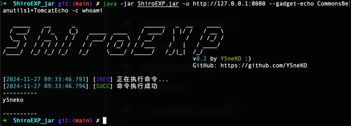
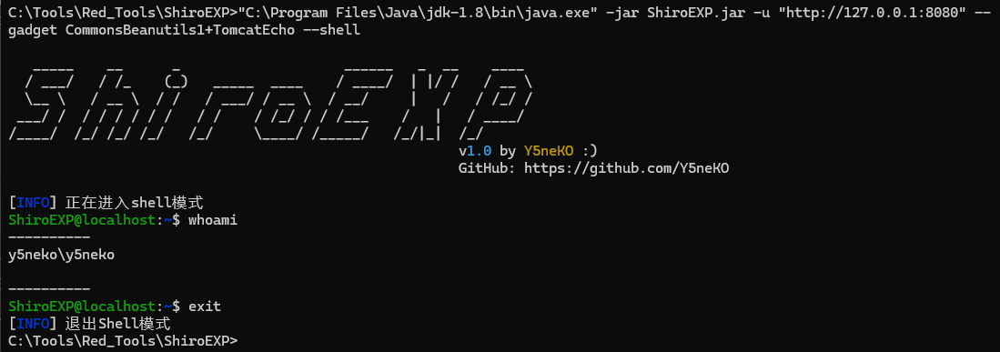

# ShiroEXP

Shiro漏洞利用工具

## Environment

`JDK 8` | `Intellij 2024`

> ⚠️ _使用其他JDK版本可能出现未知的错误_

## TODO

- 爆破key及加密方式(已完成)
- 漏洞探测(已完成Shiro550 URLDNS探测)
- 探测回显链(已完成CB1+TomcatEcho、Spring、AllEcho回显链)
- 漏洞利用(已完成命令执行、Shell模式)
- 注入内存马(支持蚁剑、冰蝎、哥斯拉等filter、servlet类型)

## Help
```zsh
C:\Tools\Red_Tools\ShiroEXP>java -jar ShiroEXP.jar -h

   _____    __      _                    ______   _  __    ____
  / ___/   / /_    (_)   _____  ____    / ____/  | |/ /   / __ \
  \__ \   / __ \  / /   / ___/ / __ \  / __/     |   /   / /_/ /
 ___/ /  / / / / / /   / /    / /_/ / / /___    /   |   / ____/
/____/  /_/ /_/ /_/   /_/     \____/ /_____/   /_/|_|  /_/
                                                       v1.0 by Y5neKO :)
                                                       GitHub: https://github.com/Y5neKO

usage: java ShiroEXP.jar [-be] [-bk] [-c <arg>] [--cookie <arg>] [--gadget
       <arg>] [--gadget-echo <arg>] [-h] [-k <arg>] [--mem-pass <arg>]
       [--mem-path <arg>] [--mem-type <arg>] [-rf <arg>] [-s] [--shell]
       [-u <arg>]
 -be,--brute-echo              爆破回显链
 -bk,--brute-key               爆破key
 -c,--cmd <arg>                执行命令
    --cookie <arg>             携带Cookie
    --gadget <arg>             指定利用链
    --gadget-echo <arg>        指定回显链
 -h,--help                     打印帮助
 -k,--key <arg>                指定key
    --mem-pass <arg>           内存马密码
    --mem-path <arg>           内存马路径
    --mem-type <arg>           打入内存马类型(输入ls查看可用类型)
 -rf,--rememberme-flag <arg>   自定义rememberMe字段名
 -s,--scan                     扫描漏洞
    --shell                    进入Shell模式
 -u,--url <arg>                目标地址
```

## Demonstrate

**爆破key及加密方式**



**漏洞验证**



**爆破回显链**



**命令执行**



**Shell模式**



**注入内存马**


## Thanks

@frohoff   https://github.com/frohoff/ysoserial

@SummerSec  https://github.com/SummerSec/ShiroAttack2

## Warnning

**本工具仅可用作学习用途和授权渗透测试，使用本工具造成的后果由使用者自行承担。**